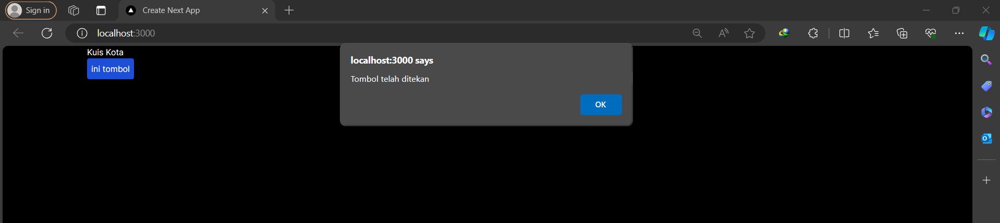
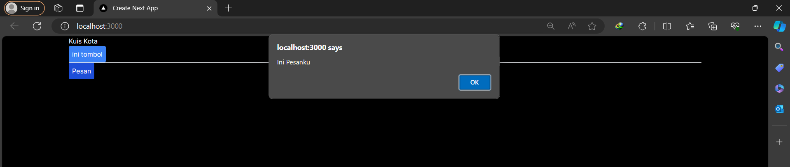
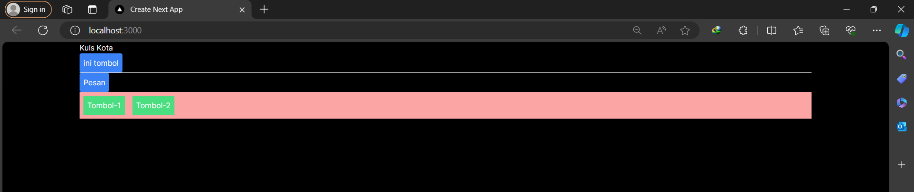
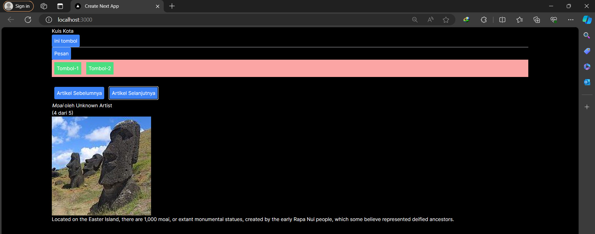
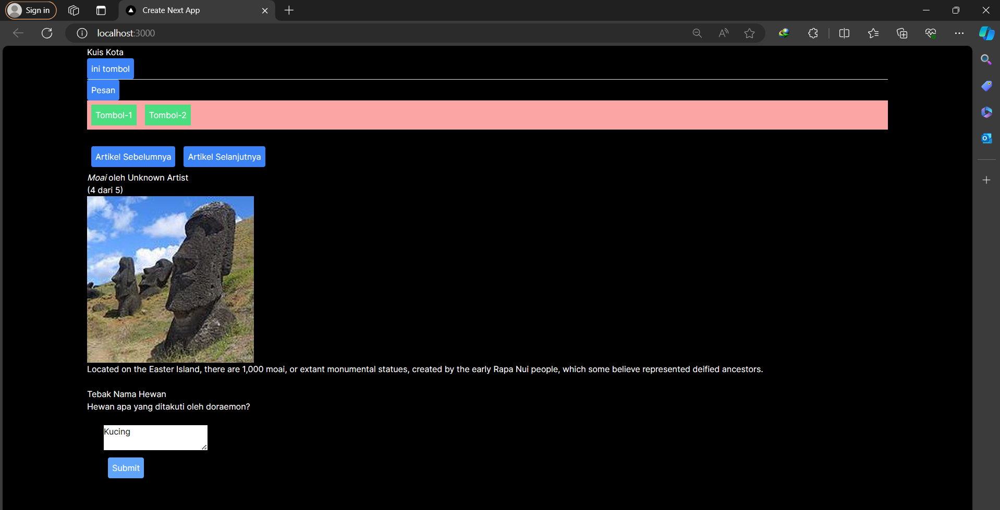
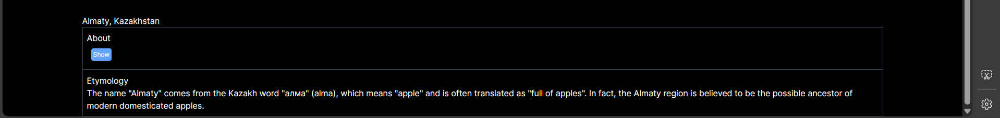

# Laporan Praktikum
- Kynantio Candra Abrari
- 2141720206
- TI 3A

## Praktikum 1

## Praktikum 2

## Praktikum 3

## Praktikum 4

Soal
1. Jika kita menekan tombol "Artikel Selanjutnya" sebanyak 5x (atau melebihi halaman total artikel), apa yang akan terjadi?

Error

2. Modifikasilah gallery.tsx agar bisa meng-handle permasalahan tersebut.

function handleClick(){
    if (index >= sculptureList.length - 1) {
        setIndex(0);
    } else {
        setIndex(index + 1);
    }
}

3. Tambahkan tombol "Artikel Sebelumnya", untuk menampilkan artikel secara mundur.

import {sculptureList} from '@/data/article';
import {useState} from 'react';

export default function Gallery(){
    const [index, setIndex] = useState(0);

    function handleNextClick(){
        if (index >= sculptureList.length - 1) {
            setIndex(0);
        } else {
            setIndex(index + 1);
        }
    }

    function handlePrevClick(){
        if (index <= 0) {
            setIndex(sculptureList.length - 1);
        } else {
            setIndex(index - 1);
        }
    }

    let sculpture = sculptureList[index];

    return(
        <>
        <button 
            onClick={handlePrevClick}
            className="bg-blue-500 hover:bg-blue-700 p-2 m-2 rounded"
        >
            Artikel Sebelumnya
        </button>
        <button 
            onClick={handleNextClick}
            className="bg-blue-500 hover:bg-blue-700 p-2 m-2 rounded"
        >
            Artikel Selanjutnya
        </button>
        <h2><i>{sculpture.name}</i> oleh {sculpture.artist}</h2>
        <h3>({index + 1} dari {sculptureList.length})</h3>
        
        

            {sculpture.description}
        

        </>
    );
}

## Praktikum 5

Soal
1. Apa perbedaan dari fungsi Form_2 yang pertama dengan yang kedua?

- Tidak ada perubahan dari fungsi yang pertama

2. Kenapa perlu menghapus state fullName? Apa keuntungannya?

- Untuk menghindari redundan dan bug pada aplikasi react

## Praktikum 6

Soal
1. Apa tujuan dari penulisan ini key={to.email} pada < Chat key={to.email} contact={to} / > ?

- Untuk memberikan React cara yang lebih efisien untuk mengidentifikasi setiap komponen dalam daftar yang diberikan. 

2. Apa fungsi dari props key tersebut?

- Untuk membantu dalam proses reconcilation saat merender daftar komponen.